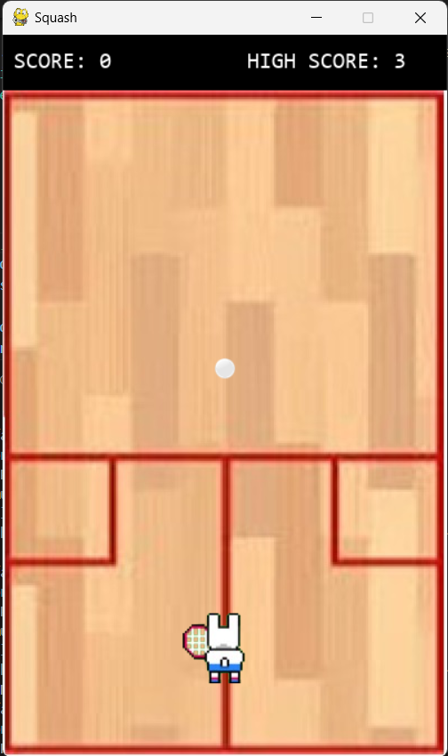

# My Game Collection
As a tech-enthusiast, I was always curious about what went on at the back-end of each game I played as a kid. 
Hence, this repository is a culmination of my long-standing curiosity and passion for game development.
Each game is a standalone project demonstrating various aspects of game development, including graphics, sound, and user interaction.

## Games

### Game 1: Pool Billiards
A single player pool game, which will help you gain practice over your pool strokes! 
Your aim is to pocket all object balls using the cue ball. You get 3 lives and lose a life every time you foul by pocketting the cue ball. 
- <b>Installation:</b> Open the "pool" directory and run "python main.py" command in the terminal. 
- <b>Tech stack:</b> Pygame and Pymunk libraries in python. 
- <b>Preview:</b> 

### Game 2: Squash
A single player squash game, to make you a pro at squash! 
You have to maintain a streak by continuously hitting the ball. Better yoursekf with each game, and beat your own high score! 
- <b>Installation:</b> Open the "squash" directory and run "python main.py" command in the terminal. 
- <b>Tech stack:</b> Pygame and random libraries in python. 
- <b>Preview:</b> 

